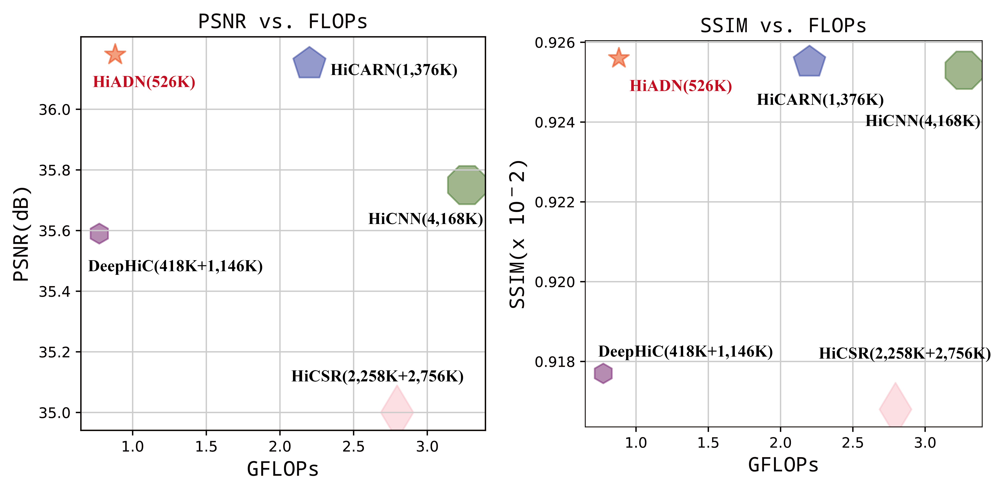
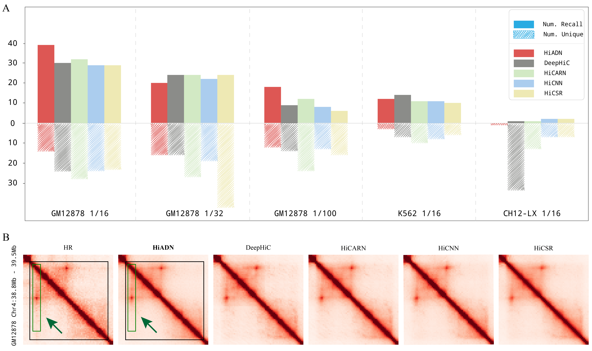
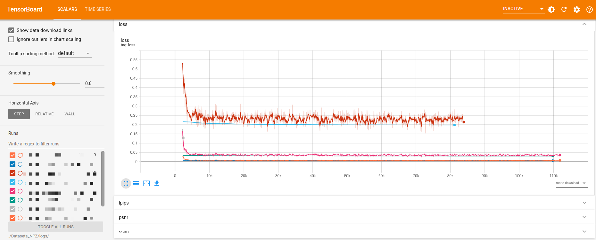

# <div align="center"><a href="#dummy"></a></div>

----------------------------------------
<div align="center">

[](https://github.com/NKUlpj)
[](https://www.hwater.site/)
[](mailto:klstftz@gmail.com)

</div>

<div align="center">

<p>
<code></code>
<code></code>
<code></code>
</p>

</div>

# 🔧 Features


---


## Unique features of HiADN

* todo
* todo
* todo






* [👥 User Guide](#-user-guide)
   - [1. Install](#1-installation)
   - [2. Requires](#2-requires)
   - [3. Data Preprocessing](#3-data-preprocessing)
      - [3.1 set-work-directory](#31-set-work-directory)
      - [3.2 read-the-raw-data](#32-read-the-raw-data)
      - [3.3 down_sample-the-data](#33-down_sample-the-data)
      - [3.4 generate-train-validation-and-test-datasets](#34-generate-train-validation-and-test-datasets)
        - [prepare-npz-data](#prepare-npz-data)
   - [4. training](#4-training)
   - [5. predict](#5-predict)
      - [5.1 predict-on-down_sample-data](#51-predict-on-down_sample-data)
      - [5.2 predict-on-matrix](#52-predict-on-matrix)
   - [6. visualization](#6-visualization)
* [📚 Appendix](#-appendix)
* [👷 Acknowledgement](#-acknowledgement)


# 👥 User Guide

## 1. Installation

Clone or Download our repo.

## 2. Requires

see `requirements.txt`


<blockquote>
<details>

<summary>We recommend using conda to create a virtual environment.</summary>
<br>

1. Install [conda](https://conda.io/projects/conda/en/latest/user-guide/install/index.html) firstly.
2. Enter the repo.
3. shell `conda create --name <your_name> --file requirements.txt`
4. shell `conda activate <your_name>`

<br>
</details>
</blockquote>


## 3. Data Preprocessing

👉 <b>In our experiments, we use the Hi-C data from (Rao et al. 2014).</b>

You can view the data on NCBI via accession [`GSE62525`](https://www.ncbi.nlm.nih.gov/geo/query/acc.cgi?acc=GSE63525); Three data sets are used:

*  [✨  `GM12878`](https://www.ncbi.nlm.nih.gov/geo/download/?acc=GSE63525&format=file&file=GSE63525%5FGM12878%5Fprimary%5Fintrachromosomal%5Fcontact%5Fmatrices%2Etar%2Egz) primary intrachromosomal
* [✨  `K562`](https://www.ncbi.nlm.nih.gov/geo/download/?acc=GSE63525&format=file&file=GSE63525%5FK562%5Fintrachromosomal%5Fcontact%5Fmatrices%2Etar%2Egz) intrachromasomal
* [✨  `CH12-LX`](https://www.ncbi.nlm.nih.gov/geo/download/?acc=GSE63525&format=file&file=GSE63525%5FCH12%2DLX%5Fintrachromosomal%5Fcontact%5Fmatrices%2Etar%2Egz) (mouse) intrachromosomal


$$ 😄 {\color{blue}!!!\ FOLLOW\ THE\ STEPS\ CAREFULLY\ !!!} $$


### 3.1 Set work directory

i. Create your root directory and write in [`/utils/config.py`](/utils/config.py);

For example, we set `root_dir = './Datasets_NPZ'`

```python
# the Root directory for all raw and processed data
root_dir = 'Datasets_NPZ'  # Example of root directory name
```

ii. Make a new directory named `raw` to store raw data.

```shell
mkdir $root_dir/raw
```

iii. Download and Unzip data into the `$root_dir/raw` directory. 

---
After doing that,your dir should be like this
<details>
<summary>🔨 FILE STRUCTURE </summary>

```
Datasets_NPZ
├── raw
│   ├── K562
│   │   ├── 1mb_resolution_intrachromosomal
│   │   └── ...
│   ├── GM12878
│   └── CH12-LX
```
</details>

<b>Follow the following steps to generate datasets in .npz format:</b>

### 3.2 Read the raw data
> This will create a new directory `$root_dir/mat/<cell_line_name>` where all `chrN_[HR].npz` files will be stored.

```text
usage: read_prepare.py -c CELL_LINE [-hr {5kb,10kb,25kb,50kb,100kb,250kb,500kb,1mb}] [-q {MAPQGE30,MAPQG0}] [-n {KRnorm,SQRTVCnorm,VCnorm}] [--help]

A tools to read raw data from Rao's Hi-C experiment.
------------------------------------------------------
Use example : python ./data/read_prepare.py -c GM12878
------------------------------------------------------

optional arguments:
  --help, -h            Print this help message and exit

Required Arguments:
  -c CELL_LINE          Required: Cell line for analysis[example:GM12878]

Miscellaneous Arguments:
  -hr {5kb,10kb,25kb,50kb,100kb,250kb,500kb,1mb}
                        High resolution specified[default:10kb]
  -q {MAPQGE30,MAPQG0}  Mapping quality of raw data[default:MAPQGE30]
  -n {KRnorm,SQRTVCnorm,VCnorm}
                        The normalization file for raw data[default:KRnorm]

```
---
After doing that,your dir should be like this

<details>
<summary>🔨 FILE STRUCTURE </summary>

```
Datasets_NPZ
├── raw
│   ├── K562
│   │   ├── 1mb_resolution_intrachromosomal
│   │   └── ...
│   ├── GM12878
│   └── CH12-LX
├── mat
│   ├── K562
│   │   ├── chr1_10kb.npz
│   │   └── ...
│   ├── GM12878
│   └── CH12-LX
```
</details>


### 3.3 Down_sample the data

> This adds down_sampled HR data to `$root_dir/mat/<cell_line_name>` as `chrN_[LR].npz`.

```text
usage: down_sample.py -c CELL_LINE -hr {5kb,10kb,25kb,50kb,100kb,250kb,500kb,1mb} -lr LOW_RES -r RATIO [--help]

A tools to down sample data from high resolution data.
----------------------------------------------------------------------
Use example : python ./data/down_sample.py -hr 10kb -lr 40kb -r 16 -c GM12878
----------------------------------------------------------------------

optional arguments:
  --help, -h            Print this help message and exit

Required Arguments:
  -c CELL_LINE          Required: Cell line for analysis[example:GM12878]
  -hr {5kb,10kb,25kb,50kb,100kb,250kb,500kb,1mb}
                        Required: High resolution specified[example:10kb]
  -lr LOW_RES           Required: Low resolution specified[example:40kb]
  -r RATIO              Required: The ratio of down sampling[example:16]

```
---
After doing that,your dir should be like this

<details>
<summary>🔨 FILE STRUCTURE </summary>

```
Datasets_NPZ
├── raw
│   ├── K562
│   │   ├── 1mb_resolution_intrachromosomal
│   │   └── ...
│   ├── GM12878
│   └── CH12-LX
├── mat
│   ├── K562
│   │   ├── chr1_10kb.npz
│   │   ├── chr1_40kb.npz
│   │   └── ...
│   ├── GM12878
│   └── CH12-LX
```
</details>

### 3.4 Generate train, validation and test datasets
* you can set your desired chromosomes for each set in [`utils/config.py`](utils/config.py) within the `set_dict` dictionary.
* This specific example will create a file in `$root_dir/data` named xxx_train.npz.

```python
# 'train' and 'valid' can be changed for different train/valid set splitting
set_dict = {'K562_test': [3, 11, 19, 21],
            'mESC_test': (4, 9, 15, 18),
            'train': [1, 3, 5, 7, 8, 9, 11, 13, 15, 17, 18, 19, 21, 22],
            'valid': [2, 6, 10, 12],
            'GM12878_test': (4, 14, 16, 20)}
```

```text
usage: split.py -c CELL_LINE -hr {5kb,10kb,25kb,50kb,100kb,250kb,500kb,1mb} -lr LOW_RES [-s {K562_test,mESC_test,train,valid,GM12878_test}] -chunk CHUNK -stride STRIDE -bound BOUND [--help]

A tools to divide data for train, predict and test.
----------------------------------------------------------------------------------------------------------
Use example : python ./data/split.py -hr 10kb -lr 40kb -s train -chunk 64 -stride 64 -bound 201 -c GM12878
----------------------------------------------------------------------------------------------------------

optional arguments:
  --help, -h            Print this help message and exit

Required Arguments:
  -c CELL_LINE          Required: Cell line for analysis[example:GM12878]
  -hr {5kb,10kb,25kb,50kb,100kb,250kb,500kb,1mb}
                        Required: High resolution specified[example:10kb]
  -lr LOW_RES           Required: Low resolution specified[example:40kb]
  -s {K562_test,mESC_test,train,valid,GM12878_test}
                        Required: Dataset for train/valid/predict

Method Arguments:
  -chunk CHUNK          Required: chunk size for dividing[example:64]
  -stride STRIDE        Required: stride for dividing[example:64]
  -bound BOUND          Required: distance boundary interested[example:201]

```

> __Note__  
> 🗿 For training, you must have both **training** and **validation** files present in `$root_dir/data`. <br>
> Change the option `-s` to generate the validation and other datasets needed 

---
After doing that,your dir should be like this

<details>
<summary>🔨 FILE STRUCTURE </summary>

```
Datasets_NPZ
├── raw
│   ├── K562
│   │   ├── 1mb_resolution_intrachromosomal
│   │   └── ...
│   ├── GM12878
│   └── CH12-LX
├── mat
│   ├── K562
│   │   ├── chr1_10kb.npz
│   │   ├── chr1_40kb.npz
│   │   └── ...
│   ├── GM12878
│   └── CH12-LX
├── data
│   ├── xxxx_train.npz
│   ├── xxxx_valid.npz
│   └── ...
```

</details>

---
<b> 💗  If you want to use your own data for training</b>
* `mkdir $root_dir/mat/<cell_name>`

#### prepare .npz data
>__Note__  
> Most common Hi-C file formats, such as [`.cool`](https://github.com/open2c/cooler) and [`.hic`](https://github.com/aidenlab/straw)
> can be easily converted to numpy matrix.
> Other formats can be converted into transition formats using [`HiCExplorer`](https://hicexplorer.readthedocs.io/en/latest/content/tools/hicConvertFormat.html) to generate numpy matrices.


>__Warning__  
> Data in following instruction is just for showing how to process your data. They cannot be used because the size of mat is too small to divide.</i>
```python
# asumming that 'mat' is a two-dimensional numpy.ndarray which stores the Hi-C matrix.
import numpy as np
mat = np.array([[3, 2, 0, 7, 0, 0, 5, 2], 
                   [2, 2, 0, 5, 0, 0, 3, 4], 
                   [0, 0, 0, 0, 0, 0, 0, 0], 
                   [7, 5, 0, 7, 0, 0, 6, 4], 
                   [0, 0, 0, 0, 0, 0, 0, 0], 
                   [0, 0, 0, 0, 0, 0, 0, 0], 
                   [5, 3, 0, 6, 0, 0, 3, 3], 
                   [2, 4, 0, 4, 0, 0, 3, 5]])

# output_filename should be like `chr1_10kb.npz`
output_filename = 'chr1_10kb.npz'
# key must be `hic`
np.savez_compressed(output_filename, hic=mat)
```

* move your `.npz` data into `$root_dir/mat/<cell_name>/`
* following the before step \<Downsample the data\>

---

## 4. Training

We have provided pre-trained file for all models:
> Note, we do not make comparison with HiCARN_2, as its performance was not as good as HiCARN_1 in its paper 🎓.

 1. HiCSR
 2. HiCNN
 3. DeepHiC
 4. HiCARN 
 5. **Ours HiADN**

To train:

**❤️ GPU acceleration is strongly recommended.**
### 4.1 All models
$$ {\color{red}!!!\ NOTE\ !!!} $$

1. Do not use absolute paths
2. Put your train/valid/test data in `$root/data/{your path/your filename}`
3. [if predict] Put your ckpt file in `$root/checkpoints/{your path/your filename}`
4. Use relative paths `{your path/your filename}`

```text
usage: train.py -m MODEL -t TRAIN_FILE -v VALID_FILE [-e EPOCHS] [-b BATCH_SIZE] [-verbose VERBOSE] [--help]

Training the models
--------------------------------------------------------------------------------------------
Use example : python train.py -m HiADN -t c64_s64_train.npz -v c64_s64_valid.npz -e 50 -b 32
--------------------------------------------------------------------------------------------

optional arguments:
  --help, -h        Print this help message and exit

Miscellaneous Arguments:
  -m MODEL          Required: models[HiADN, HiCARN, DeepHiC, HiCSR, HiCNN]
  -t TRAIN_FILE     Required: training file[example: c64_s64_train.npz]
  -v VALID_FILE     Required: valid file[example: c64_s64_valid.npz]
  -e EPOCHS         Optional: max epochs[example:50]
  -b BATCH_SIZE     Optional: batch_size[example:32]
  -verbose VERBOSE  Optional: recording in tensorboard [example:1( meaning True)]
```
This function will output `.pytorch` checkpoint files containing the trained weights in 
`$root_dir/checkpoints/{model_name}_{best or final}.pytorch`.

If using arguments `-verbose`, run shell
```shell
tensorboard --logdir ./Datasets_NPZ/logs/ --port=<your port>
```
Now you can use visualization in Browser to observe changes in indicators during model training




## 5. Predict
We provide pretrained weights for ours models and all other compared models. You can also use the weights generated by your own trainning data. 

### 5.1 predict on down_sample data
These datasets are obtained by down_sampling, so they have corresponding targets.

But this data has never been put into the model before【Just for test and comparison】.
```text
usage: predict.py -m MODEL -t PREDICT_FILE [-b BATCH_SIZE] -ckpt CKPT [--help]

Predict
--------------------------------------------------------------------------------------------------
Use example : python predict.py -m HiADN -t c64_s64_GM12878_test.npz -b 64 -ckpt best_ckpt.pytorch
--------------------------------------------------------------------------------------------------

optional arguments:
  --help, -h       Print this help message and exit

Miscellaneous Arguments:
  -m MODEL         Required: models[HiADN, HiCARN, DeepHiC, HiCSR, HICNN]
  -t PREDICT_FILE  Required: predicting file[example: c64_s64_GM12878_test.npz]
  -b BATCH_SIZE    Optional: batch_size[example:64]
  -ckpt CKPT       Required: Checkpoint file[example:best.pytorch]

```

### 5.2 Predict on matrix
1. `mkdir $root/mat/{your cell_line}`
2. Put your `chr{num}_{resolution}.npz` file in above dir
3. run shell `python ./data/split_matrix.py -h` to generate data for predict

```shell
usage: split_matrix.py -c CELL_LINE -chunk CHUNK -stride STRIDE -bound BOUND [--help]

A tools to generate data for predict.
----------------------------------------------------------------------------------------------------------
Use example : python ./data/split_matrix.py -chunk 64 -stride 64 -bound 201 -c GM12878
----------------------------------------------------------------------------------------------------------

optional arguments:
  --help, -h      Print this help message and exit

Required Arguments:
  -c CELL_LINE    Required: Cell line for analysis[example:GM12878]

Method Arguments:
  -chunk CHUNK    Required: chunk size for dividing[example:64]
  -stride STRIDE  Required: stride for dividing[example:64]
  -bound BOUND    Required: distance boundary interested[example:201]

```

4. run shell `python predict.py -h` to predict [[`same as predict-on-down_sample-data`]](#predict-on-down_sample-data)

## 6. Visualization

```text
usage: visualization.py -f FILE -s START -e END [-p PERCENTILE] [-c CMAP] [-n NAME] [--help]

Visualization
--------------------------------------------------------------------------------------------------
Use example : python ./visual.py -f hic_matrix.npz -s 14400 -e 14800 -p 95 -c 'Reds'
--------------------------------------------------------------------------------------------------

optional arguments:
  --help, -h     Print this help message and exit

Miscellaneous Arguments:
  -f FILE        Required: a npy file out from predict
  -s START       Required: start bin[example: 14400]
  -e END         Required: end bin[example: 14800]
  -p PERCENTILE  Optional: percentile of max, the default is 95.
  -c CMAP        Optional: color map[example: Reds]
  -n NAME        Optional: the name of pic[example: chr4:14400-14800]

```

> Figure will be saved to $root_dir/img

`cmap`:  [👉 see matplotlib doc](https://matplotlib.org/stable/tutorials/colors/colormaps.html)

Recommended:

1. Reds
2. YlGn
3. Greys
4. YlOrRd


# 📚 Appendix
The output predictions are stored in .npz files that contain numpy arrays under keys.

To access the predicted HR matrix, use the following command in a python file: 
```python
"""
# .npz file is like a dict
a = np.load("path/to/file.npz", allow_pickle=True)
# to show all keys
a.files
# return a numpy array
a['key_name'] 
"""
import numpy as np
hic_matrix = np.load("path/to/file.npz", allow_pickle=True)['hic']
```
# 👷 Acknowledgement

We thank for some wonderful repo, including
1. [DeepHiC](https://github.com/omegahh/DeepHiC) : some code for data processing.
    * utils/io_helper.py
2. [RFDN](https://github.com/njulj/RFDN): some code for backbone of HiADN
   * models/common.py